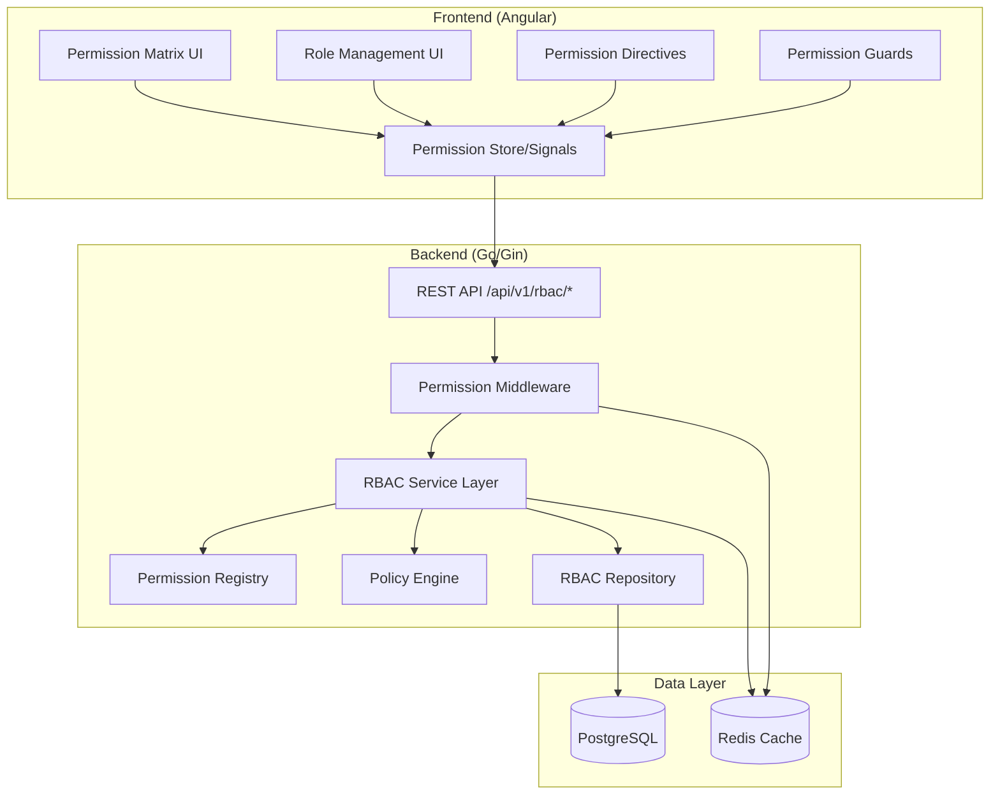
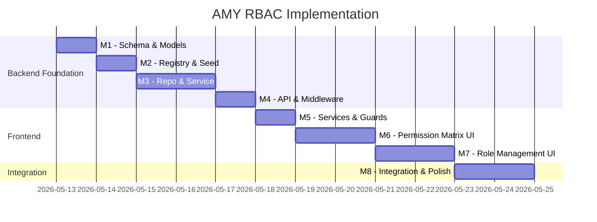

# AMY Enterprise-Grade Roles & Permissions — Implementation Plan

> **Target Route:** `http://localhost:4200/platform/roles`
> **Stack:** Go (Gin) + PostgreSQL + Redis | Angular 20+ (Signals, Standalone Components)

---

## Current State Assessment

| Layer | What Exists | Gap |
|-------|------------|-----|
| **Auth** | JWT with `SystemRole` enum (10 roles), `RequireRole` middleware | No granular permissions, no RBAC tables |
| **Permissions** | Simple `Permission` string type, hardcoded `RolePermissions` map by `JobTypeCategory` | Not database-driven, no tenant overrides, no policy engine |
| **Frontend Guards** | `roleGuard(…roles)` checks `SystemRole` only | No permission-level guards, no `*hasPermission` directive |
| **Models** | `User.SystemRole`, `TenantJobType.Category`, `IndustryTemplate` | No `roles`, `permissions`, `role_permissions` tables |
| **Platform UI** | Placeholder component at `/platform/roles` | Needs full implementation |
| **Audit** | Basic `AuditLog` model + repo | Needs RBAC-specific audit events |
| **Redis** | Already a dependency (`go-redis/v9`) | Not used for permission caching yet |

---

## Architecture Overview



---

## Milestones

---

### Milestone 1: Database Schema & Go Models
**Goal:** Create the foundational database tables and Go domain models for RBAC.

#### Deliverables

- [ ] **Migration `000025_create_rbac_tables.up.sql`**
  - `roles` table (UUID PK, name, slug, description, tenant_id, industry_type, is_system, is_template, is_active, parent_role_id, metadata JSONB, created_by, updated_by, timestamps, soft delete)
  - `permissions` table (UUID PK, key unique, module, description, risk_level, category, is_system, depends_on, metadata JSONB, timestamps)
  - `role_permissions` table (role_id + permission_id composite PK, granted_by, granted_at)
  - `user_roles` table (user_id + role_id + tenant_id composite unique, assigned_by, assigned_at, expires_at nullable)
  - `policies` table (UUID PK, name, description, permission_key, conditions JSONB, is_active, priority, timestamps)
  - `role_templates` table (UUID PK, industry_type, role_name, role_slug, description, permissions JSON array, is_default, timestamps)
  - Composite indexes for multi-tenant queries
  - Down migration

- [ ] **Go Models** in `internal/models/rbac.go`
  - `Role` struct with all fields, GORM tags, UUID PK
  - `PermissionDef` struct (database representation of a permission)
  - `RolePermission` join struct
  - `UserRole` struct with tenant context
  - `Policy` struct with conditions JSONB
  - `RoleTemplate` struct for industry defaults

- [ ] **Permission Key Constants** in `internal/models/permission_keys.go`
  - ~80 permission keys organized by module:
    - `workers.*` (view, create, update, delete, export, assign, verify_kyc, bulk_import)
    - `assignments.*` (view, create, update, delete, clock_in, clock_out, approve, bulk_assign, verify_gps, approve_overtime)
    - `earnings.*` (view, create, adjust, approve, export)
    - `wallet.*` (view, withdraw, fund_float, approve_payout, reconcile, reverse_transaction)
    - `payroll.*` (view, run, approve, process, export, manage_schedules)
    - `compliance.*` (view, generate_reports, manage_deductions, submit_statutory)
    - `loans.*` (view, apply, approve, reject, disburse)
    - `insurance.*` (view, enroll, cancel, manage_policies)
    - `documents.*` (view, upload, delete, verify)
    - `settings.*` (view, update, manage_tenant, manage_billing)
    - `reports.*` (view, export, create_custom)
    - `roles.*` (view, create, update, delete, assign, manage_permissions)
    - `users.*` (view, create, update, deactivate, manage_roles)
    - `audit.*` (view, export)
    - `platform.*` (manage_organizations, manage_users, manage_finance, view_analytics)

#### Acceptance Criteria
- Migration runs cleanly on existing database
- Models compile with proper GORM tags and JSON serialization
- No existing tests break

---

### Milestone 2: Permission Registry & Domain Layer
**Goal:** Build the centralized permission registry and seed system.

#### Deliverables

- [ ] **Permission Registry** (`internal/rbac/registry.go`)
  - `PermissionDefinition` struct: Key, Module, Description, RiskLevel, Category, DependsOn
  - `Registry` struct with thread-safe registration
  - `Register(module Module)` method for developers
  - `GetAll()`, `GetByModule()`, `GetByKey()` lookups
  - Global singleton with `init()` auto-registration
  - Module grouping (Workers, Assignments, Earnings, Wallet, Payroll, Compliance, Loans, Insurance, Documents, Settings, Reports, Roles, Users, Audit, Platform)

- [ ] **Industry Role Templates** (`internal/rbac/templates.go`)
  - Template definitions per industry from PRD:
    - **Transport SACCO:** Driver, Conductor, Booking Agent, Route Supervisor, SACCO Admin
    - **Construction:** General Laborer, Equipment Operator, Site Foreman, Site Supervisor
    - **Logistics:** Rider, Dispatcher, Sorter, Warehouse Supervisor
    - **Community Health:** Promoter, Lead Promoter, Area Coordinator
    - **Agriculture:** Picker, Field Worker, Team Leader
    - **Hospitality:** Waiter, Cook, Shift Lead
    - **Platform:** Super Admin, Auditor, Compliance Officer, Support Agent
  - Each template maps to a set of permission keys

- [ ] **Seed Command Extension** (`cmd/seed/`)
  - Seed all permissions from registry into `permissions` table
  - Seed industry role templates into `role_templates` table
  - Seed system roles (Platform Super Admin, Platform Auditor, etc.)
  - Idempotent execution (ON CONFLICT DO UPDATE)

- [ ] **Policy Engine** (`internal/rbac/policy.go`)
  - `PolicyEngine` struct
  - `Evaluate(ctx, userID, permKey, context) (bool, error)` method
  - Condition types: time_range, risk_level, mfa_required, amount_threshold
  - Composable conditions with AND/OR logic

#### Acceptance Criteria
- `permissions.Register(Module{...})` works at init time
- `go run ./cmd/seed` seeds ~80 permissions + 7 industry templates
- Policy engine evaluates simple conditions correctly

---

### Milestone 3: Repository & Service Layer
**Goal:** Implement data access and business logic for RBAC operations.

#### Deliverables

- [ ] **Repository Interfaces** (add to `internal/repository/interfaces.go`)
  ```go
  type RBACRepository interface {
      // Roles
      CreateRole(ctx, role) error
      GetRoleByID(ctx, id) (*Role, error)
      GetRoleBySlug(ctx, slug, tenantID) (*Role, error)
      UpdateRole(ctx, role) error
      DeleteRole(ctx, id) error  // soft delete
      ListRoles(ctx, filter) ([]Role, int64, error)
      CloneRole(ctx, sourceID, newName, tenantID) (*Role, error)

      // Permissions
      ListPermissions(ctx, filter) ([]PermissionDef, error)
      SyncPermissions(ctx, defs) error  // upsert from registry

      // Role-Permission mapping
      AssignPermissions(ctx, roleID, permIDs) error
      RevokePermissions(ctx, roleID, permIDs) error
      GetRolePermissions(ctx, roleID) ([]PermissionDef, error)
      BulkSetPermissions(ctx, roleID, permIDs) error  // replace all

      // User-Role mapping
      AssignRoleToUser(ctx, userID, roleID, tenantID) error
      RevokeRoleFromUser(ctx, userID, roleID, tenantID) error
      GetUserRoles(ctx, userID, tenantID) ([]Role, error)
      GetUserPermissions(ctx, userID, tenantID) ([]string, error)  // flattened keys

      // Policies
      CreatePolicy(ctx, policy) error
      GetActivePolicies(ctx, permKey) ([]Policy, error)

      // Templates
      ListTemplates(ctx, industryType) ([]RoleTemplate, error)
      ApplyTemplate(ctx, templateID, tenantID) error
  }
  ```

- [ ] **Postgres Implementation** (`internal/repository/postgres/rbac_repo.go`)
  - All interface methods with proper GORM queries
  - Composite index usage for multi-tenant queries
  - Transaction-safe bulk operations
  - Efficient `GetUserPermissions` with JOINs (user_roles → role_permissions → permissions)

- [ ] **RBAC Service** (`internal/service/rbac_service.go`)
  - `RBACService` struct with dependency injection
  - Role CRUD with validation (slug uniqueness per tenant, system role protection)
  - Permission assignment with dependency checks
  - User role management with privilege escalation prevention
  - Template application (clone template roles into tenant)
  - Role comparison (diff two roles' permissions)
  - Audit logging on all mutations

- [ ] **Permission Cache** (`internal/service/permission_cache.go`)
  - Redis-backed permission cache
  - Key format: `rbac:perms:{userID}:{tenantID}` → `[]string`
  - TTL: 5 minutes (configurable)
  - Invalidation on role/permission changes
  - Distributed invalidation via Redis pub/sub
  - Fallback to DB on cache miss
  - `HasPermission(ctx, userID, tenantID, permKey) bool` — fast path

#### Acceptance Criteria
- All repository methods have unit tests with mocks
- Permission cache reduces DB queries by >90% for auth checks
- Privilege escalation prevented (can't assign permissions you don't have)
- Audit log entries created for all RBAC mutations

---

### Milestone 4: REST API & Middleware
**Goal:** Expose RBAC functionality via REST endpoints and implement permission-based middleware.

#### Deliverables

- [ ] **RBAC Handlers** (`internal/handler/rbac_handler.go`)
  ```
  GET    /api/v1/rbac/roles                    — List roles (with filters)
  POST   /api/v1/rbac/roles                    — Create role
  GET    /api/v1/rbac/roles/:id                — Get role detail
  PUT    /api/v1/rbac/roles/:id                — Update role
  DELETE /api/v1/rbac/roles/:id                — Archive role (soft delete)
  POST   /api/v1/rbac/roles/:id/clone          — Clone role
  POST   /api/v1/rbac/roles/:id/activate       — Activate/deactivate
  GET    /api/v1/rbac/roles/:id/permissions     — Get role's permissions
  PUT    /api/v1/rbac/roles/:id/permissions     — Set role's permissions (bulk)
  POST   /api/v1/rbac/roles/compare            — Compare two roles

  GET    /api/v1/rbac/permissions               — List all permissions (grouped)
  GET    /api/v1/rbac/permissions/modules        — List permission modules

  GET    /api/v1/rbac/users/:id/roles           — Get user's roles
  POST   /api/v1/rbac/users/:id/roles           — Assign role to user
  DELETE /api/v1/rbac/users/:id/roles/:roleId   — Revoke role from user
  GET    /api/v1/rbac/users/:id/permissions      — Get user's effective permissions

  GET    /api/v1/rbac/templates                  — List industry templates
  POST   /api/v1/rbac/templates/:id/apply        — Apply template to tenant

  GET    /api/v1/rbac/policies                   — List policies
  POST   /api/v1/rbac/policies                   — Create policy

  GET    /api/v1/rbac/matrix                     — Get permission matrix (roles × perms)
  ```

- [ ] **Request/Response DTOs** (`internal/handler/dto/rbac_dto.go`)
  - All request validation structs with `binding:"required"` tags
  - Response structs with consistent envelope
  - Matrix response format for UI consumption

- [ ] **Permission Middleware** (`internal/middleware/permission.go`)
  - `RequirePermission(permKeys ...string)` — checks user has ALL specified permissions
  - `RequireAnyPermission(permKeys ...string)` — checks user has ANY specified permission
  - Uses Redis cache for fast lookups
  - Tenant context from JWT claims
  - Falls back to `RequireRole` for backward compatibility
  - Audit log on denied access

- [ ] **Route Registration** — Wire new handlers into existing router
  - All RBAC routes under `/api/v1/rbac/` prefix
  - Protected by `JWTAuth` + platform role checks
  - Swagger annotations on all endpoints

#### Acceptance Criteria
- All endpoints return proper HTTP status codes and error envelopes
- Permission middleware works alongside existing `RequireRole` middleware
- Swagger docs generated for all RBAC endpoints
- API integration tests pass

---

### Milestone 5: Angular Services, State & Guards
**Goal:** Build frontend infrastructure for permission-based access control.

#### Deliverables

- [ ] **TypeScript Models** (add to `core/models/index.ts`)
  ```typescript
  interface Role { id, name, slug, description, tenant_id, industry_type, is_system, is_template, is_active, parent_role_id, metadata, permission_count, created_at, updated_at }
  interface PermissionDef { id, key, module, description, risk_level, category }
  interface PermissionModule { name, permissions: PermissionDef[] }
  interface RolePermissionMatrix { roles: Role[], modules: PermissionModule[], grants: Record<roleId, Set<permKey>> }
  interface UserRole { user_id, role_id, role: Role, tenant_id, assigned_at, expires_at }
  interface RoleTemplate { id, industry_type, role_name, description, permissions: string[], is_default }
  interface RoleComparison { role_a: Role, role_b: Role, only_in_a: string[], only_in_b: string[], shared: string[] }
  ```

- [ ] **RBAC API Service** (`features/platform/roles/services/rbac-api.service.ts`)
  - All CRUD operations mapped to backend endpoints
  - Proper error handling and loading states
  - Type-safe request/response handling

- [ ] **Permission Store** (`core/services/permission.service.ts`)
  - Signal-based store for current user's permissions
  - `permissions = signal<Set<string>>(new Set())`
  - `can(permKey: string): boolean` — computed check
  - `canAny(...permKeys: string[]): boolean`
  - `canAll(...permKeys: string[]): boolean`
  - Loaded on login + token refresh
  - LocalStorage persistence for offline awareness

- [ ] **Permission Guard** (`core/guards/permission.guard.ts`)
  - `permissionGuard(...permKeys: string[]): CanActivateFn`
  - Works alongside existing `roleGuard`
  - Redirects to dashboard with toast on denial

- [ ] **Permission Directive** (`shared/directives/has-permission.directive.ts`)
  - Structural directive: `*hasPermission="'workers.create'"`
  - Removes element from DOM when permission denied
  - Reacts to permission changes via signals

- [ ] **Permission Pipe** (`shared/pipes/can.pipe.ts`)
  - `{{ 'workers.create' | can }}` — returns boolean for template use

#### Acceptance Criteria
- Permission store loads on login and persists to localStorage
- `*hasPermission` directive correctly shows/hides elements
- Permission guard blocks routes without proper permissions
- All permission checks complete synchronously (no flickering)

---

### Milestone 6: Permission Matrix UI
**Goal:** Build the enterprise-grade permission matrix (spreadsheet-like grid).

#### Deliverables

- [ ] **Permission Matrix Component** (`features/platform/roles/components/permission-matrix/`)
  - Spreadsheet-like grid: rows = permissions (grouped by module), columns = roles
  - Checkbox toggle at each intersection
  - Module headers as section separators with expand/collapse
  - Sticky first column (permission name) + sticky header row (role names)
  - Risk level badges (low/medium/high/critical) on permission rows
  - Bulk select: toggle entire module, entire role column, or entire row
  - Search/filter bar for permissions (fuzzy match on key + description)
  - Role filter dropdown (show/hide specific roles)
  - Visual diff highlighting when changes are unsaved
  - Save/discard toolbar with change count
  - Keyboard navigation (arrow keys, space to toggle, tab between cells)
  - Virtual scrolling for large permission sets (angular CDK)

- [ ] **Permission Module Sidebar** (`features/platform/roles/components/module-sidebar/`)
  - Left panel listing all modules with permission counts
  - Click to scroll-to-section in matrix
  - Badge showing modified count per module
  - Search within sidebar

- [ ] **Styles & Theming**
  - Dark mode compatible
  - Enterprise aesthetic (subtle borders, hover effects, micro-animations)
  - Responsive: stacks on mobile with role selector dropdown
  - Color coding: green = granted, red/empty = denied, amber = inherited

#### Acceptance Criteria
- Matrix renders 80+ permissions × 10+ roles without jank
- Inline toggle updates are batched and saved on explicit action
- Search filters permissions in real-time (<50ms)
- Keyboard-accessible (WCAG 2.1 AA)

---

### Milestone 7: Role Management UI
**Goal:** Build the full role management interface at `/platform/roles`.

#### Deliverables

- [ ] **Roles List Page** (`features/platform/roles/pages/roles-list/`)
  - Card grid / table view toggle
  - Role cards showing: name, industry, permission count, user count, status badge
  - Quick actions: edit, clone, archive, toggle active
  - Filter by: industry type, system/custom, active/archived, template
  - Search by name/description
  - "Create Role" CTA button
  - Industry template gallery (quick-start from template)

- [ ] **Role Detail/Edit Dialog** (`features/platform/roles/components/role-dialog/`)
  - Create/edit role form (name, slug auto-gen, description, industry, parent role)
  - Embedded permission matrix (for this single role)
  - Permission search + bulk category toggle
  - Preview affected users
  - Save with confirmation for high-risk changes

- [ ] **Role Comparison View** (`features/platform/roles/components/role-comparison/`)
  - Side-by-side two-role comparison
  - Permissions diff: added (green), removed (red), shared (neutral)
  - Module-level summary
  - "Copy permissions" action between roles

- [ ] **User Role Assignment** (`features/platform/roles/components/user-role-assign/`)
  - Search users by name/phone
  - Assign/revoke roles per user
  - Show effective permissions preview
  - Expiry date option for temporary roles

- [ ] **Template Gallery** (`features/platform/roles/components/template-gallery/`)
  - Industry-grouped template cards
  - Preview template permissions before applying
  - "Apply to Tenant" action with customization option
  - Template versioning display

- [ ] **RBAC Dashboard Header**
  - Summary stats: total roles, active, templates, total permissions
  - Quick action buttons
  - Last audit activity

#### Acceptance Criteria
- Full CRUD for roles with real-time validation
- Role comparison shows clear visual diff
- Template application creates tenant-specific roles
- All mutations trigger audit log entries
- UI matches enterprise aesthetic (dark theme, animations, Material components)

---

### Milestone 8: Integration, Polish & Hardening
**Goal:** Wire everything together, add security hardening, and polish.

#### Deliverables

- [ ] **Backend Integration**
  - Wire `RequirePermission` middleware on critical existing endpoints
  - Add permission keys to existing handlers incrementally:
    - `/api/v1/crew/*` → `workers.*` permissions
    - `/api/v1/assignments/*` → `assignments.*` permissions
    - `/api/v1/payroll/*` → `payroll.*` permissions
    - `/api/v1/wallets/*` → `wallet.*` permissions
  - Backward-compatible: existing `RequireRole` still works

- [ ] **Frontend Integration**
  - Add `*hasPermission` directive to key UI elements
  - Update sidebar navigation to show/hide based on permissions
  - Add permission checks to dashboard quick-actions
  - Ensure KYC guard and permission guard work together

- [ ] **Security Hardening**
  - Deny-by-default on all new endpoints
  - Privilege escalation prevention (can't grant perms you don't have)
  - System role/permission immutability (can't delete built-in)
  - Tenant isolation (can't see/modify other tenant's roles)
  - Rate limiting on RBAC mutation endpoints
  - Sensitive action confirmation dialogs

- [ ] **Audit Trail Enhancement**
  - RBAC-specific audit events (role.created, permission.granted, etc.)
  - Before/after value snapshots on permission changes
  - Audit log viewer in RBAC UI (recent activity tab)

- [ ] **Offline Awareness**
  - Cached permission snapshot in localStorage
  - Stale indicator when offline
  - Revalidation on reconnect
  - Grace period for recently cached permissions

- [ ] **Performance Optimization**
  - Redis TTL tuning
  - Batch permission checks for page loads
  - Virtual scrolling verification for large datasets
  - API response caching headers

- [ ] **Tests**
  - Backend unit tests for RBAC service (escalation, tenant isolation)
  - API integration tests for all RBAC endpoints
  - Frontend component tests for matrix interaction
  - E2E test: create role → assign permissions → assign to user → verify access

#### Acceptance Criteria
- Existing functionality unchanged (backward compatible)
- Permission checks add <5ms to request latency (Redis path)
- No N+1 queries in permission resolution
- Full audit trail for all RBAC operations
- All tests pass

---

## Execution Order & Dependencies



## File Inventory (New Files)

### Backend (~15 new files)
| File | Purpose |
|------|---------|
| `migrations/000025_create_rbac_tables.up.sql` | RBAC database schema |
| `migrations/000025_create_rbac_tables.down.sql` | Rollback migration |
| `internal/models/rbac.go` | Role, Permission, Policy domain models |
| `internal/models/permission_keys.go` | All permission key constants |
| `internal/rbac/registry.go` | Centralized permission registry |
| `internal/rbac/templates.go` | Industry role template definitions |
| `internal/rbac/policy.go` | Policy evaluation engine |
| `internal/repository/postgres/rbac_repo.go` | PostgreSQL RBAC data access |
| `internal/service/rbac_service.go` | RBAC business logic |
| `internal/service/permission_cache.go` | Redis permission cache |
| `internal/handler/rbac_handler.go` | REST API handlers |
| `internal/handler/dto/rbac_dto.go` | Request/response DTOs |
| `internal/middleware/permission.go` | Permission-check middleware |

### Frontend (~15 new files)
| File | Purpose |
|------|---------|
| `features/platform/roles/services/rbac-api.service.ts` | API service |
| `features/platform/roles/state/rbac.store.ts` | Signal-based state |
| `features/platform/roles/pages/roles-list.component.ts` | Main page |
| `features/platform/roles/components/permission-matrix.component.ts` | Matrix grid |
| `features/platform/roles/components/module-sidebar.component.ts` | Module nav |
| `features/platform/roles/components/role-dialog.component.ts` | Create/edit dialog |
| `features/platform/roles/components/role-comparison.component.ts` | Diff view |
| `features/platform/roles/components/user-role-assign.component.ts` | User assignment |
| `features/platform/roles/components/template-gallery.component.ts` | Template browser |
| `core/services/permission.service.ts` | Global permission store |
| `core/guards/permission.guard.ts` | Permission route guard |
| `shared/directives/has-permission.directive.ts` | `*hasPermission` directive |
| `shared/pipes/can.pipe.ts` | `can` pipe |

---

## Key Design Decisions

| # | Decision | Rationale |
|---|----------|-----------|
| 1 | **Keep `SystemRole` for backward compat** | Existing guards and middleware continue to work. RBAC is additive. |
| 2 | **Permissions as DB entities, not hardcoded** | Enables runtime registration, tenant overrides, and UI management. Registry provides source-of-truth for seed. |
| 3 | **Redis cache with pub/sub invalidation** | Sub-millisecond permission checks. Distributed invalidation for multi-instance deploys. |
| 4 | **Flat permission keys (`module.action`)** | Simple, grep-friendly, no deep nesting. Aligns with AWS IAM patterns. |
| 5 | **Policy engine is optional layer** | Basic RBAC works without policies. Policies add time/amount/MFA conditions for high-risk actions. |
| 6 | **Template-based role seeding** | Operators pick industry → get sensible defaults → customize. No blank-slate complexity. |
| 7 | **Frontend permission store as signals** | Synchronous checks (no async flickering). Works with Angular's change detection. |
| 8 | **Deny-by-default** | New endpoints require explicit permission. Principle of least privilege. |

---

> [!IMPORTANT]
> **Ready to begin?** Approve this plan and I'll start with **Milestone 1** — the database migration and Go models. Each milestone produces working, testable code that can be verified independently before moving to the next.
